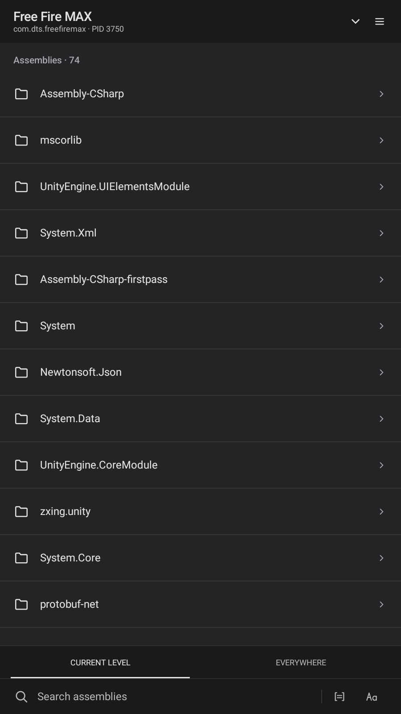
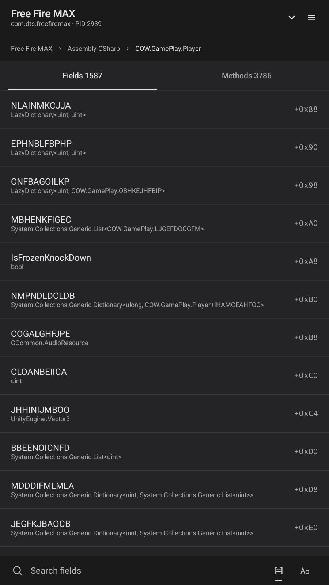
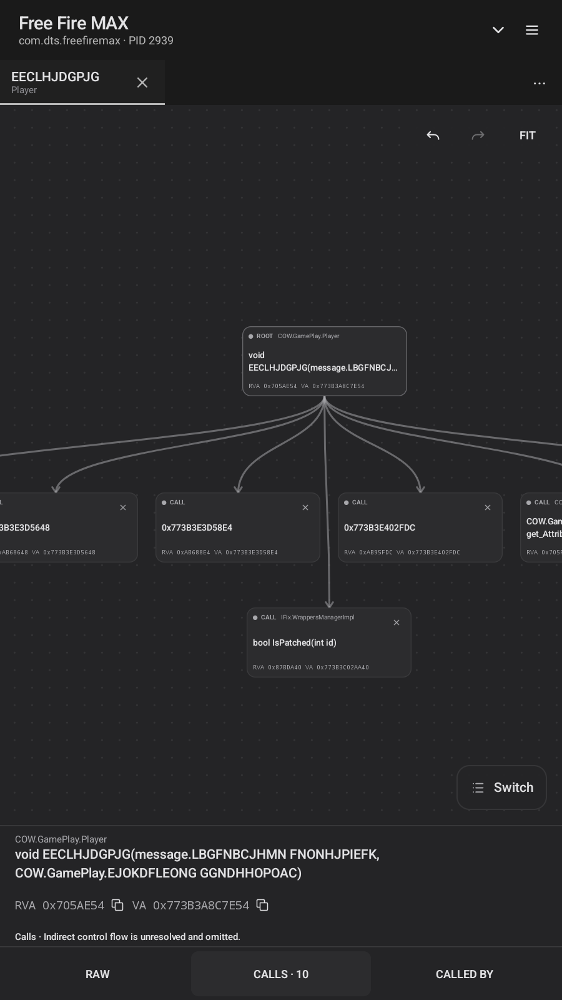
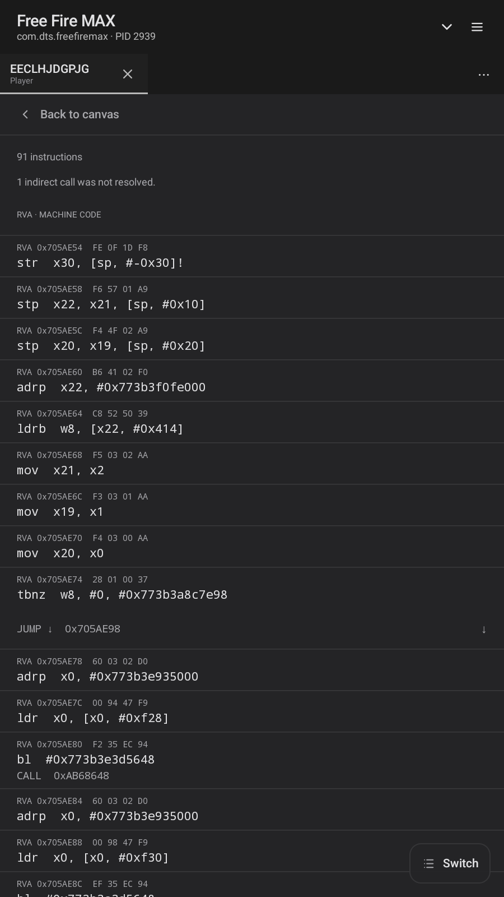

<p align="center">
  
</p>

<h1 align="center">IL2CppManager</h1>

<p align="center">
  <strong>Inspect IL2CPP where it runs.</strong><br>
  A root-powered Android workbench for browsing runtime metadata, reading native instructions, and tracing direct method relationships.
</p>

<p align="center">
  <a href="#requirements"></a>
  <a href="#requirements"></a>
  <a href="#requirements"></a>
  <a href="LICENSE"></a>
  <a href="https://t.me/il2cppmanager"></a>
</p>

<p align="center">
  <a href="#what-it-does">Features</a> ·
  <a href="#inside-the-app">Screenshots</a> ·
  <a href="#build-from-source">Build</a> ·
  <a href="https://github.com/bapanxd/IL2CppManager">Source</a> ·
  <a href="https://t.me/il2cppmanager">Telegram</a>
</p>

---

## What it does

IL2CppManager turns a selected running Unity IL2CPP process into a focused, navigable workspace.

<table>
  <tr>
    <td width="50%" valign="top">
      <strong>Metadata navigation</strong><br>
      Move through assemblies, namespaces, classes, fields, and methods.
    </td>
    <td width="50%" valign="top">
      <strong>Precision search</strong><br>
      Search the current level or globally with exact and case-sensitive matching.
    </td>
  </tr>
  <tr>
    <td width="50%" valign="top">
      <strong>Address detail</strong><br>
      Inspect field types and offsets, method signatures, RVAs, and virtual addresses.
    </td>
    <td width="50%" valign="top">
      <strong>Native instructions</strong><br>
      Read decoded bytes, mnemonics, operands, and resolved call or branch targets in <code>RAW</code>.
    </td>
  </tr>
  <tr>
    <td width="50%" valign="top">
      <strong>Direct call graphs</strong><br>
      Explore <code>CALLS</code> and <code>CALLED BY</code> with pan, zoom, draggable nodes, fit, undo, and redo.
    </td>
    <td width="50%" valign="top">
      <strong>Method workspaces</strong><br>
      Keep multiple method canvases open and move between graph and instruction views.
    </td>
  </tr>
</table>

## Inside the app

<p align="center">
  <a href="docs/screenshots/assemblies.png"></a>
  <a href="docs/screenshots/fields.png"></a>
  <a href="docs/screenshots/call-graph.png"></a>
  <a href="docs/screenshots/raw-instructions.png"></a>
</p>

<p align="center">
  <sub>Assemblies · Fields · Call graph · Raw instructions — select any image to enlarge.</sub>
</p>

## Quick start

<p align="center">
  <code>SELECT PROCESS</code> → <code>BROWSE OR SEARCH</code> → <code>OPEN METHOD</code> → <code>RAW / CALL GRAPH</code>
</p>

1. Start the Unity IL2CPP app you want to inspect.
2. Open IL2CppManager and grant root access.
3. Select the running target process from the header.
4. Browse or search its metadata, then open a method for native instructions or direct call relationships.

## Requirements

| | Requirement |
|---|---|
| **Android** | Android 8.0 or newer (API 26+) |
| **Privilege** | Working `su` root access |
| **Target** | A running Unity IL2CPP app exposing `libil2cpp.so` |
| **Architecture** | A 64-bit `arm64-v8a` or `x86_64` target process |

## Build from source

### Toolchain

| Tool | Required version |
|---|---:|
| JDK | 17 |
| Android SDK Platform | 37 |
| Android NDK | `28.2.13676358` |
| CMake | `3.22.1` |

Android SDK Platform-Tools is also required to install the APK with `adb`.

### Android Studio

1. Open the repository root in Android Studio.
2. Let Gradle sync and install any missing SDK, NDK, or CMake components.
3. Select the `app` module and the `debug` build variant, then build the APK.

<details>
<summary><strong>Command-line build</strong></summary>

#### Windows

```powershell
.\gradlew.bat :app:assembleDebug
```

#### macOS or Linux

```sh
./gradlew :app:assembleDebug
```

The debug APK is written to `app/build/outputs/apk/debug/app-debug.apk`.

</details>

### Install

With a device connected through ADB:

```sh
adb install -r app/build/outputs/apk/debug/app-debug.apk
```

## Responsible use

> [!IMPORTANT]
> Use IL2CppManager only on devices and software that you own or have explicit permission to analyze. You are responsible for complying with applicable laws, licenses, and terms.

IL2CppManager is an independent project. It is not affiliated with, sponsored by, or endorsed by Unity Technologies. Unity and related marks belong to their respective owners.

## Credits and license

IL2CppManager is released under the [Apache License 2.0](LICENSE).

<details>
<summary><strong>Core third-party software</strong></summary>

- **[Capstone 5.0.9](https://github.com/capstone-engine/capstone/tree/5.0.9)** — BSD-3-Clause. See the [bundled Capstone notice](app/src/main/assets/licenses/capstone-LICENSE.txt).
- **[libsu 6.0.0](https://github.com/topjohnwu/libsu)** — Apache License 2.0. See the [bundled Apache License 2.0 text](app/src/main/assets/licenses/apache-2.0.txt).

</details>

---

<p align="center">
  <a href="https://github.com/bapanxd/IL2CppManager">GitHub</a> ·
  <a href="https://t.me/il2cppmanager">Official Telegram</a> ·
  <a href="https://t.me/bapanff">Developer</a>
</p>
